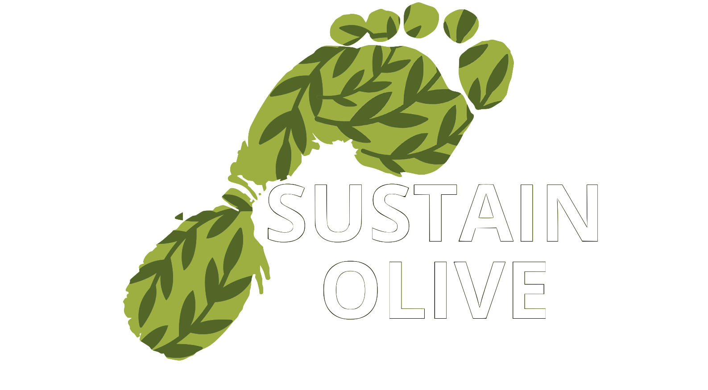

# SustainOlive Frontend

A React-based web application for monitoring and managing olive cultivation IoT devices and sustainability models. This application provides a comprehensive dashboard for tracking environmental data, device management, and sustainability analytics in olive farming operations.



## 🌿 About the Project

SustainOlive Frontend is part of a larger IoT ecosystem designed to promote sustainable olive farming practices. The application connects to IoT devices deployed in olive groves to collect environmental data, monitor device status, and provide insights for sustainable agriculture management.

### Key Features

- **Device Management**: Monitor and manage IoT devices deployed in olive groves
- **Real-time Data Visualization**: View live environmental data with interactive charts
- **Historical Data Analysis**: Access and analyze historical sensor data over time
- **Model Management**: Create, edit, and manage sustainability models
- **3D Visualization**: Interactive 3D models for enhanced data representation
- **Event Monitoring**: Track device events and system alerts
- **Responsive Design**: Optimized for desktop and mobile viewing

## 🛠️ Technology Stack

- **Frontend Framework**: React 19.1.0 with TypeScript
- **Build Tool**: Vite 7.0.4
- **Routing**: React Router DOM 7.6.3
- **3D Graphics**: Three.js with React Three Fiber & Drei
- **Charts**: Recharts for data visualization
- **HTTP Client**: Axios for API communication
- **Styling**: CSS with custom components
- **Icons**: React Icons
- **Fonts**: Inter font family

## 📋 Prerequisites

Before running this project, ensure you have:

- **Node.js** (version 18 or higher)
- **npm** or **yarn** package manager
- **Backend API** running (Eclipse Ditto-based)
- **Historical Data API** running (port 5555)

## 🚀 Getting Started

### Installation

1. **Clone the repository**
   ```bash
   git clone https://github.com/HendrickFS/SustainOlive-frontend.git
   cd SustainOlive-frontend
   ```

2. **Install dependencies**
   ```bash
   npm install
   ```

3. **Environment Configuration**
   
   Create a `.env` file in the root directory (optional):
   ```env
   VITE_API_URL=http://localhost:8080/
   VITE_HISTORICAL_API_URL=http://localhost:5555/
   ```

   The application uses these default URLs if not specified:
   - Main API: `http://localhost:8080/`
   - Historical API: `http://localhost:5555/`

### Running the Application

1. **Development Mode**
   ```bash
   npm run dev
   ```
   The application will be available at `http://localhost:5173`

2. **Build for Production**
   ```bash
   npm run build
   ```

3. **Preview Production Build**
   ```bash
   npm run preview
   ```

4. **Linting**
   ```bash
   npm run lint
   ```

## 📁 Project Structure

```
sustainolive-frontend/
├── public/                          # Static assets
│   ├── studio_small_09_4k.hdr      # HDR environment map
│   ├── deposit/                     # 3D deposit models
│   └── questionMarkModel/           # 3D question mark model
├── src/
│   ├── api/                         # API integration
│   │   ├── axios.ts                 # Axios configuration
│   │   ├── modelApi.ts              # Model API endpoints
│   │   └── historicalApi.ts         # Historical data API
│   ├── assets/                      # Images and 3D models
│   ├── components/                  # Reusable React components
│   │   ├── DeviceList.tsx           # Device listing component
│   │   ├── ModelsGrid.tsx           # Models grid layout
│   │   ├── DataCard.tsx             # Data visualization cards
│   │   └── Menu.tsx                 # Navigation menu
│   ├── pages/                       # Page components
│   │   ├── Login.tsx                # Authentication page
│   │   ├── Home.tsx                 # Dashboard home
│   │   ├── Models.tsx               # Models management
│   │   ├── DeviceDataPage.tsx       # Device data visualization
│   │   └── AllEventsPage.tsx        # System events
│   ├── utils/                       # Utility functions
│   │   ├── formatting.ts            # Data formatting helpers
│   │   ├── dittoConnectionUtils.ts  # Ditto connection utilities
│   │   └── dittoModelUtils.ts       # Ditto model utilities
│   ├── App.tsx                      # Main application component
│   └── main.tsx                     # Application entry point
├── package.json                     # Dependencies and scripts
├── vite.config.ts                   # Vite configuration
└── tsconfig.json                    # TypeScript configuration
```

## 🔧 API Integration

The application integrates with two main APIs:

### 1. Main API (Eclipse Ditto)
- **Base URL**: `http://localhost:8080/`
- **Authentication**: Basic Auth (ditto/ditto)
- **Purpose**: Device management, model CRUD operations
- **Endpoints**:
  - GET `/api/2/things` - List all devices/models
  - GET `/api/2/things/{thingId}` - Get specific device/model
  - POST `/api/2/things` - Create new device/model
  - PUT `/api/2/things/{thingId}` - Update device/model
  - DELETE `/api/2/things/{thingId}` - Delete device/model

### 2. Historical Data API
- **Base URL**: `http://localhost:5555/`
- **Purpose**: Time-series data retrieval
- **Endpoints**:
  - GET `/data?thingId={id}&feature={feature}&range_start={range}` - Get historical data

## 🏗️ Architecture

### Component Architecture
- **Pages**: Top-level route components
- **Components**: Reusable UI components
- **API Layer**: Centralized API communication
- **Utils**: Helper functions and utilities

### State Management
- React useState for local component state
- Props drilling for data sharing
- API calls using Axios with async/await

### Routing Structure
```
/ (root)                    → Login Page
/home                       → Dashboard Home
/models                     → Models Management
/new-model                  → Create New Model
/edit-model/:thingId        → Edit Existing Model
/model-info/:thingId        → Model Details
/models-data                → Models Data Overview
/all-events                 → System Events
/devices                    → Device List
/device-data/:thingId       → Device Data Visualization
/device-events/:thingId     → Device Events
```

## 🎨 Features Overview

### 1. Authentication
- Simple login interface with olive farming themed design
- Navigation to dashboard after authentication

### 2. Dashboard Home
- Device list overview
- Real-time status monitoring
- Quick access to device details

### 3. Model Management
- Grid view of all sustainability models
- Create new models with custom parameters
- Edit existing models
- View detailed model information
- 3D visualization of models

### 4. Device Monitoring
- List all connected IoT devices
- Real-time data visualization with charts
- Historical data analysis
- Event tracking and alerts

### 5. Data Visualization
- Interactive charts using Recharts
- 3D models with Three.js
- Responsive design for various screen sizes

## 🔌 Environment Variables

| Variable | Description | Default |
|----------|-------------|---------|
| `VITE_API_URL` | Main API base URL | `http://localhost:8080/` |
| `VITE_HISTORICAL_API_URL` | Historical data API URL | `http://localhost:5555/` |

## 🧪 Development

### Code Style
- ESLint configuration included
- TypeScript for type safety
- React 19 with latest features
- Functional components with hooks

### Development Commands
```bash
npm run dev      # Start development server
npm run build    # Build for production
npm run preview  # Preview production build
npm run lint     # Run ESLint
```

## 👥 Authors

- **HendrickFS** - [GitHub Profile](https://github.com/HendrickFS)

## 🙏 Acknowledgments

- Instituto Politécnico de Bragança (IPB)
- SustainOlive Project Team
- Eclipse Ditto Project
- React Community
- Three.js Community


---

**SustainOlive Frontend** - Monitoring sustainability in olive farming through IoT technology 🌿
